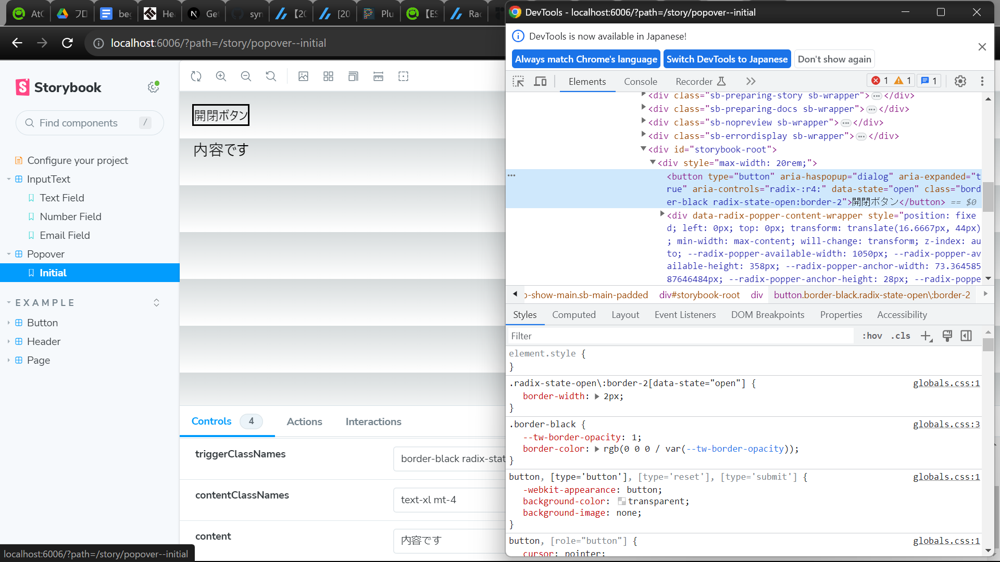

This is a [Next.js](https://nextjs.org/) project bootstrapped with [`create-next-app`](https://github.com/vercel/next.js/tree/canary/packages/create-next-app).

## Getting Started

First, run the development server:

```bash
npm run dev
# or
yarn dev
# or
pnpm dev
```

Open [http://localhost:3000](http://localhost:3000) with your browser to see the result.

You can start editing the page by modifying `app/page.tsx`. The page auto-updates as you edit the file.

This project uses [`next/font`](https://nextjs.org/docs/basic-features/font-optimization) to automatically optimize and load Inter, a custom Google Font.

## Learn More

To learn more about Next.js, take a look at the following resources:

- [Next.js Documentation](https://nextjs.org/docs) - learn about Next.js features and API.
- [Learn Next.js](https://nextjs.org/learn) - an interactive Next.js tutorial.

You can check out [the Next.js GitHub repository](https://github.com/vercel/next.js/) - your feedback and contributions are welcome!

## Deploy on Vercel

The easiest way to deploy your Next.js app is to use the [Vercel Platform](https://vercel.com/new?utm_medium=default-template&filter=next.js&utm_source=create-next-app&utm_campaign=create-next-app-readme) from the creators of Next.js.

Check out our [Next.js deployment documentation](https://nextjs.org/docs/deployment) for more details.

[デプロイ先のurl](https://dinner-ranking.vercel.app/)

## 本 PJ のボイラー生成コマンド

npx create-next-app@latest dinner-ranking --ts --tailwind --eslint --app --src-dir --import-alias --use-yarn

### Jest 導入

- npm install --save-dev jest jest-environment-jsdom @testing-library/react @testing-library/jest-dom
- npm i -D jest ts-jest @types/jest
- jest.config.js を作成[公式参照](https://nextjs.org/docs/pages/building-your-application/optimizing/testing#setting-up-jest-with-the-rust-compiler)
  →[参考になった記事](https://zenn.dev/miruoon_892/articles/e42e64fbb55137)
  →[ts-jest で参考になった記事](https://qiita.com/ridai/items/d87d77e329644aad3086)

## storybook

[導入の参考](https://panda-program.com/posts/nextjs-storybook-typescript-errors)

起動コマンド
npm run storybook



## Windows での開発のやり方

1. Windows で WSL2 インストール
2. wsl にて本 PJ ディレクトリを展開し、wsl のシェルを開いて code .で VSCode を WSL 繋いで起動
3. ルートに.devcontainer.json ファイルを作成しているため、VSCode 拡張の DevContainer でコンテナ起動（要 DockerDesktop）

## Radix UI導入

一つのコンポーネントごとにパッケージが分かれており、必要なコンポーネントのみインストールする
tailwindcssと組み合わせるには設定が必要であり、大変なので以下の「プラグインを導入すること
npm i tailwindcss-radix
tailwind.config.tsにプラグイン追加

## tailwindのクラス参考

https://tailwindcomponents.com/cheatsheet/

## Next.jsとreactで考えるべき実装差異

approuter
https://zenn.dev/yumemi_inc/articles/next-13-app-overview

ServerComponentsかstateによりインタラクションするクライアントコンポーネントか
https://nextjs.org/docs/getting-started/react-essentials#when-to-use-server-and-client-components

## react-hook-form導入

https://www.react-hook-form.com/get-started/

フォーム内のフィールドは非制御コンポーネントが基本っぽい（制御コンポーネントとも合わせられる）
バリデーションは基本HTML5バリデーションっぽい
備忘
https://developer.mozilla.org/ja/docs/Learn/Forms/Form_validation

制御コンポーネントはuseControllerぽい
https://www.react-hook-form.com/api/usecontroller/

## tailwind \* radixuiのスタイル参考

https://codesandbox.io/s/ecklf-tailwindcss-radix-demo-51pm1?file=/components/select.tsx:916-966

## CMS(Content Management System)の採用調査

最も有名なのはWordpressだが、デザインや機能に自由度がない。

Headless CMSの採用が良さそう
https://wk-partners.co.jp/homepage/blog/hpseisaku/htmlcss/headless-cms/

DBとバックエンドを自前で用意するとランニングコストは免れないので、CMS使って永続データは任せるのが財布に優しそう

[prismic.ioが無料枠あって良さそう](https://prismic.io/)
[prismic.ioを利用した採用例]https://zenn.dev/mogami/articles/prismic_jamstack

prismicはフロント側でprismicクライアントを生成し、APIコールするっぽい

[vercel公式のprismic採用例](https://vercel.com/templates/next.js/prismic-blog)
[vercel×prismic](https://zenn.dev/k41531/articles/d05ce3527f594d)
